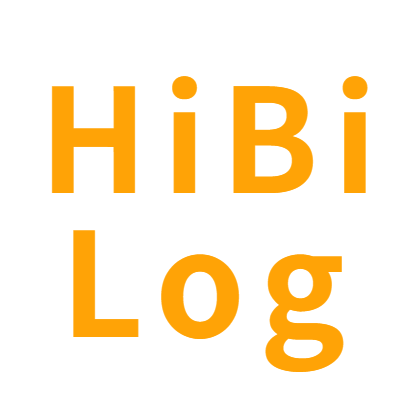
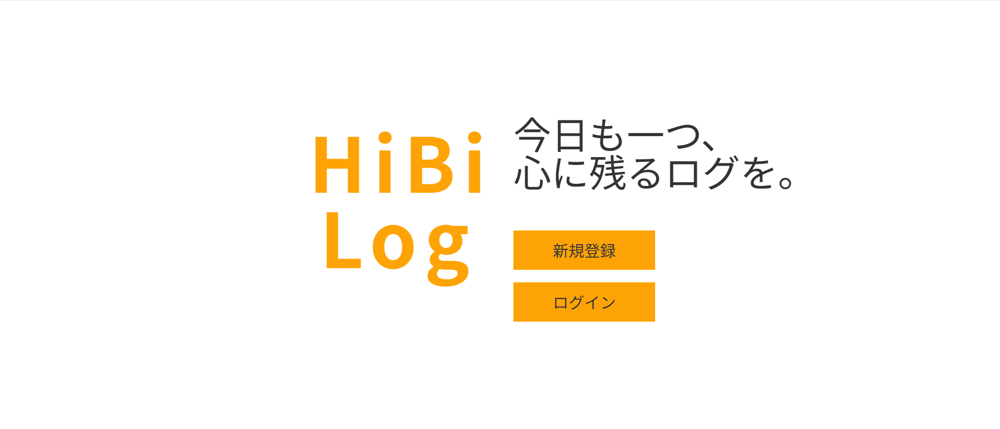
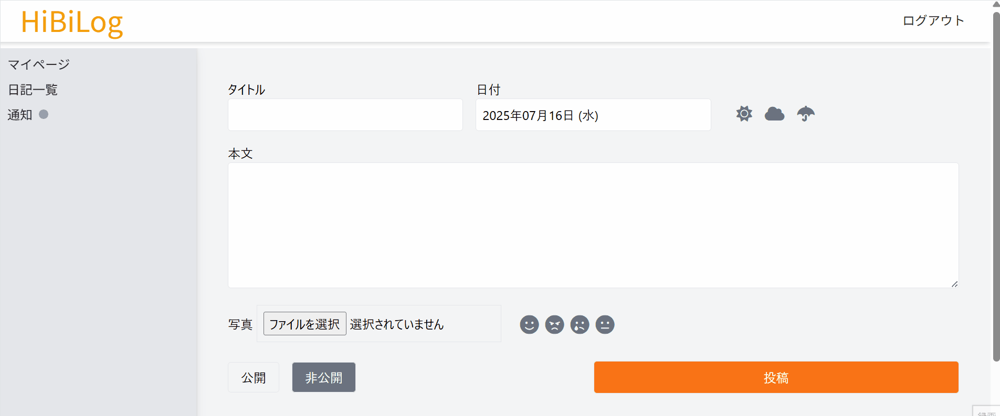
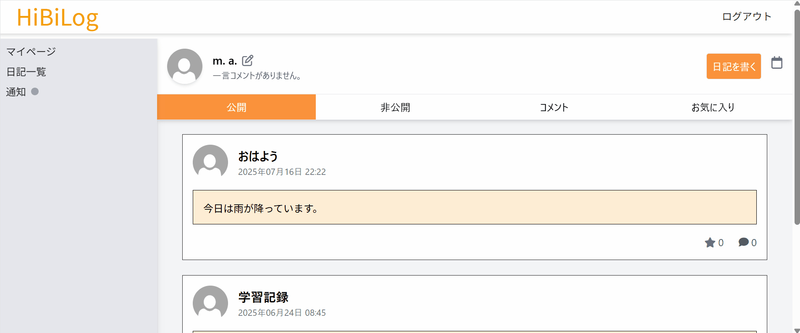
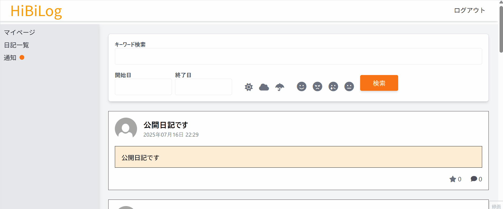

# HibiLog（ひびログ）

 

---

# 目次

- [サービス概要](#-サービス概要)
- [サービス URL](#-サービスurl)
- [開発の背景](#-開発の背景)
- [機能紹介](#-機能紹介)
- [技術構成について](#-技術構成について)
  - [使用技術](#使用技術)
  - [ER 図](#er図)
  - [画面遷移図](#画面遷移図) 

---

# 🌍 サービス概要

HibiLog は、短文の日記や感じたことを機能的に投稿できる Web 日記アプリです。 
非公開日記として、自分だけの日記を書くのも良し。公開日記としてコメントやいいねなどの SNS 的な要素を使い、コミュニケーションをとることもできます。

---

# 🌐 サービス URL

https://hibilog.com

---

# 📖 開発の背景

プログラミングスクールに通い始めたことをきっかけに、日々の学習や日常を記録する日記習慣ができました。その中で、成長や気持ちの変化に気づける経験がひとつの実りとなり、この体験を他の人にも届けたいという思いから、このアプリを開発しました。

---

# 💻 機能紹介

- ユーザー登録/ログイン (メール+Google OAuth)
  google アカウントでのログインも可能です
  

- 日記投稿 (タイトル+本文+日時+天気+感情+画像)
  タイトル、日時、本文のみ必須項目です
  天気、感情、画像は必要に応じて登録できます

- 画像投稿 / 表示
- コメント機能
- いいね機能
- 検索機能 (キーワード / 期間 / 天気 / 感情 )
  日記に登録したそれぞれの条件で検索可能です
  見たい日記が簡単に検索できます
  

- 公開設定 (公開/非公開)
  日記は公開日記として全ユーザーに共有することもできますが
  非公開日記として自分だけの日記を管理することもできます
  

- 日記投稿日をカレンダー表示 (simple_calendar)
  マイページのカレンダーアイコンから日記を書いた日を確認できます
  日記を書いていない日はカレンダーページから新規作成できます
  

- 通知機能 (いいね / コメント)
  他のユーザーからいいね、コメントがあった際には通知が届きます
  確認した通知はグレーアウトします
  

---

# 🔧 技術構成について

## 使用技術

| カテゴリ       | 内容                                 |
| -------------- | ------------------------------------ |
| サーバーサイド | Ruby on Rails 8 / Ruby 3.2           |
| フロントエンド | Tailwind CSS / Stimulus / JavaScript |
| バックエンド   | PostgreSQL                           |
| テスト         | RSpec / FactoryBot                   |
| 診断 / CI      | RuboCop / Brakeman / GitHub Actions  |
| ログイン       | Sorcery / Google OAuth2              |
| デプロイ       | Render / Docker / GitHub Actions     |

## ER 図

[ER 図 - Gyazo](https://gyazo.com/1e2dac8144b05b81d4129e53ffdf1000)

## 画面遷移図

[Figma 画面遷移図](https://www.figma.com/design/uCwxo2gTmsbj3ZzZxnH5O6/Diary-Application?node-id=0-1&t=eDly5tGJKtBEKPuJ-1)

---

# 🔮 今後の拡張予定

- 「1 年前の今日の投稿」を表示する振り返り機能
- SNS 連携を通じた発信機能

---
